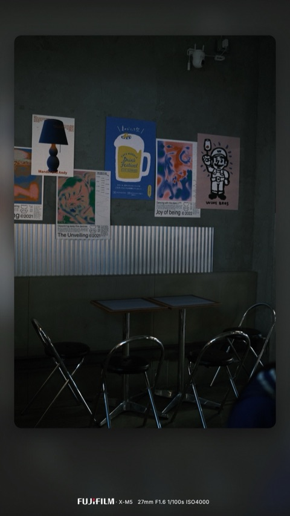
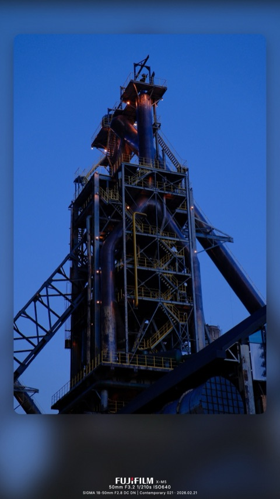

<div align="center">


# photo-tools

**Frosted-glass camera frame for your photos — pure browser, no server.**

[](https://anois.github.io/photo-tools/)
[](https://photo-tools.oss-cn-hangzhou.aliyuncs.com/)
[](#stack)
[](#quick-start)
[](https://github.com/anois/photo-tools)

[中文](README.zh-CN.md) · English

</div>

A single-page web app that wraps photos in a "frosted-glass" frame — blurred self-background, rounded foreground, EXIF caption with brand logo. Drag in a photo, pick a frame, export. Everything runs in your browser; no upload, no backend.

```
   ┌─────────────────────┐
   │ ░░░░░░░░░░░░░░░░░░ │
   │ ░ ┌──────────────┐ ░ │       blurred self-background
   │ ░ │              │ ░ │       + rounded foreground
   │ ░ │    photo     │ ░ │       + EXIF caption
   │ ░ │              │ ░ │
   │ ░ └──────────────┘ ░ │
   │   FUJIFILM  X-T5    │
   │   46mm  F4.5  1/210s │
   └─────────────────────┘
```

## 🤖 Maintained by Claude Code

This project is maintained autonomously by [Claude Code](https://claude.com/claude-code). There are no human committers — every line of code, every doc update, every CHANGELOG entry is produced by an AI agent inside the maintenance pipeline.

- **Want a feature, hit a bug, or have an idea?** Open a [GitHub Issue](https://github.com/anois/photo-tools/issues/new). Plain prose is fine; a few lines describing what you'd like is enough.
- **How it ships**: reasonable Issues are pulled periodically, fed to a Claude Code session that implements + tests + writes the CHANGELOG bullet, and auto-deploys via GitHub Pages + the Aliyun OSS mirror.
- **Track what landed**: every shipped change shows up in [`public/CHANGELOG.md`](public/CHANGELOG.md). The ✦ pill in the topbar surfaces it inside the app, with a small accent dot whenever there's a version you haven't seen yet.

## Features

- **12 frame styles in 4 families** — Editorial (frosted, frosted-noir, editorial spread, editorial mirror), Gallery (gallery-white passe-partout, gallery-noir phosphor highlight), Instant (polaroid, instax, torn paper), Film (film-35 with sprocket holes + leader stamp, film-mf medium format, **kodak-pro** with red+black brand banner)
- **11 caption templates in 4 grammars** — Spec (minimal-text, tech-stack, **spec-grid** Hasselblad-style outlined capsules, **spec-rail** Leica-style vertical capsules), Brand (brand-logo, brand-right), Editorial (wordmark, headline with GPS+date hero line), Stamp (date-lens, slate OSD field grid, passport postmark)
- **Real bundled brand logos** — Fujifilm, Sony, Leica, Nikon, Canon, Apple, Xiaomi, OPPO, Vivo, DJI… (Wikimedia Commons + simple-icons)
- **Auto EXIF parsing** with per-photo manual override and `LensInfo` → lens-model fallback
- **Custom signature overlay** — upload an SVG/PNG and pin it to a corner of the photo; persisted across sessions in `localStorage`
- **Custom background image** — replace the self-blur frosted-bg source with any image you like (only applies to frosted frames)
- **Save / share presets** — snapshot the current look (frame / template / padding / shadow / signature) as a named local preset, or copy a share link (`#p=<code>`) for a friend
- **HEIC / HEIF input** — iPhone photos transcode in-browser via lazy-loaded libheif-js (only fetched on first HEIC import)
- **Collage mode** — pair 2–4 photos in one frame: side-by-side, stacked, 1×3 / 3×1 row, or 2×2 grid
- **90° rotation + free-form crop** — per-photo, render-time only (source bitmap untouched, fully reversible)
- **GPS coordinates** — opt-in caption field that prints decimal lat/lon when EXIF GPS is present (off by default for privacy). Source missing GPS? Type lat/lon directly in the EXIF panel, or hit **📍 Pick on map** for a Leaflet + AutoNavi (高德地图) modal (lazy-loaded, ~165KB, only fetched on first use; AutoNavi is reachable from mainland China where OSM is firewalled). GCJ-02 ↔ WGS-84 correction is applied at the Leaflet boundary so EXIF stays in standard WGS-84 even though the rendered tiles are GCJ-02 (a no-op outside China). Export writes the chosen coords into the JPEG's GPS IFD even when the source had no EXIF.
- **Installable PWA** — service worker precaches the SPA shell so the app loads instantly and works fully offline after the first visit
- **Live preview** via Canvas2D + GPU `ctx.filter` blur — no round-trip to a server
- **Single + batch export** with EXIF round-trip preserved on JPEG (Make / Model / focal / aperture / shutter / ISO / lens / date / GPS)
- **Web-Worker pool** for batch render off the main thread
- **Bilingual UI** — Chinese / English toggle in the topbar; auto-detects browser locale on first visit, persists choice in `localStorage`
- **Surface-native interaction** — desktop and mobile each speak their own gesture grammar (not one scaled-up from the other):
  - **Desktop**: collapsible left sidebar with a vertical activity bar (`a–g` tiles, accent-bar active marker, dashed film-leader spine), `[` to fold, `⌘1–7` to jump sections, hold `Space` to peek at the unframed source (Photoshop/Lightroom convention), right-click on a filmstrip thumbnail for an "apply this photo's frame/EXIF to all" + "remove" context menu.
  - **Mobile (≤768px)**: thumb-zone Export dock pinned to the viewport bottom (52pt CTA, safe-area-aware), horizontal swipe on the canvas for prev/next photo, 0.5s long-press on the canvas to peek at the original, long-press a thumbnail to bring up the same context menu, changelog modal slides up as an iOS-style bottom sheet with drag handle.

## Preview

Two real outputs from the live pipeline:

<table>
  <tr>
    <td width="50%"></td>
    <td width="50%"></td>
  </tr>
  <tr>
    <td align="center"><sub><b>frosted-dark</b> · <b>minimal-text</b><br/>FUJIFILM X-M5 · 27mm F1.6 1/100s ISO4000</sub></td>
    <td align="center"><sub><b>frosted</b> · <b>tech-stack</b><br/>FUJIFILM X-M5 · SIGMA 18-50mm F2.8 · 2026.02.21</sub></td>
  </tr>
</table>

<sub>Above are 480px previews. Full-resolution outputs (`data/*_framed.jpg`) and the source originals sit side-by-side under [`data/`](data/) so you can compare the round-trip.</sub>

## Quick start

```bash
git clone https://github.com/anois/photo-tools.git
cd photo-tools
npm install
npm run build       # generates logos.json + fonts.css
npm run dev         # → http://localhost:3000
```

That's it — open the URL, drop in a photo, tweak the controls, export.

## How it works

```
┌──────────────────────────── browser tab ─────────────────────────────┐
│                                                                      │
│  index.html → <script> vendored libs (exifr, piexif, jszip)         │
│             → <script> shared/render.js   (layout + frames + caption SVG)
│             → <script> exifio.js          (parse + write JPEG EXIF) │
│             → <script> clientRender.js    (Canvas pipeline)         │
│             → <script> exporter.js        (single + batch + ZIP)    │
│             → <script> app.js             (UI + per-photo cfg)      │
│                                                                      │
│  Boot fetch: logos.json (~60KB)  +  fonts.css (~870KB base64 Inter) │
└──────────────────────────────────────────────────────────────────────┘
```

A single shared module — `public/shared/render.js` — owns all layout math, frame definitions, caption-SVG construction, and template rendering. The on-screen preview and the full-resolution export both go through the same code path; only the canvas size differs.

For exhaustive architecture notes, see [CLAUDE.md](CLAUDE.md).

## Project layout

```
photo-tools/
├── public/                 ← deployable artifact (no build step)
│   ├── index.html
│   ├── app.js              ← UI wiring + per-photo cfg state
│   ├── shared/render.js    ← layout + frames + caption SVG (single source of truth)
│   ├── clientRender.js     ← Canvas2D compose pipeline (preview + export)
│   ├── exifio.js           ← EXIF parse (exifr) + JPEG re-attach (piexifjs)
│   ├── exporter.js         ← single + batch export + ZIP packing
│   ├── worker.js           ← off-main-thread render for batch
│   ├── progressModal.js    ← <dialog> controller for batch progress
│   ├── i18n.js             ← zh-CN / en dictionaries + locale switcher
│   ├── styles.css
│   ├── logo.svg            ← project logo (favicon + README header)
│   ├── vendor/             ← exifr, piexif, jszip (vendored, no CDN)
│   ├── logos/*.svg         ← brand logo source SVGs (Wikimedia + simple-icons)
│   ├── fonts/*.ttf         ← Inter Regular + SemiBold
│   ├── logos.json          ← built from logos/*.svg
│   └── fonts.css           ← built from fonts/*.ttf
├── scripts/
│   ├── build-logos.js      ← logos/*.svg  → logos.json
│   ├── build-fonts.js      ← fonts/*.ttf  → fonts.css
│   └── fetch-logos.sh      ← scrape Wikimedia Commons / simple-icons
└── data/                   ← reference input/output photos
```

## Deployment

The `public/` directory is the entire deployable artifact — no transpilation, no bundling. Any static host works.

**GitHub Pages** (live at [anois.github.io/photo-tools](https://anois.github.io/photo-tools/), $0):

The workflow lives in [.github/workflows/deploy.yml](.github/workflows/deploy.yml). Every push to `main` triggers it: install deps → `npm run build` → upload `./public/` → publish. Manual re-runs available via the **Actions** tab.

**One-time setup**: in repo Settings → Pages, set **Source** to `GitHub Actions`.

**Other hosts** (S3 + CloudFront, Cloudflare Pages, Netlify, Vercel, …): same idea — point them at `public/` after running `npm run build`.

### China-domestic mirror via Aliyun OSS

GitHub Pages is intermittently slow / unreachable from mainland China. The same `public/` artifact is also synced to an Aliyun OSS bucket (mainland region, no ICP filing) for a domestic entry:

```
https://photo-tools.oss-cn-hangzhou.aliyuncs.com/
```

The deploy job ([deploy.yml](.github/workflows/deploy.yml) → `deploy-oss`) runs in parallel with the GitHub Pages job — a failure on one target doesn't block the other.

**One-time Aliyun setup** (needed before the first OSS deploy):

1. **Create bucket**: OSS Console → Create Bucket
   - Region: `oss-cn-hangzhou` (or any mainland region)
   - ACL: **Public Read** (`public-read`)
   - In **Static Website** settings, set default index document to `index.html`
2. **Create RAM sub-user**: RAM Console → Users → Create user `photo-tools-deploy`
   - Access type: **OpenAPI Access**
   - Attach a custom policy scoped to the bucket only (least-privilege):
     ```json
     {
       "Version": "1",
       "Statement": [{
         "Effect": "Allow",
         "Action": ["oss:PutObject", "oss:DeleteObject", "oss:GetObject", "oss:ListObjects"],
         "Resource": ["acs:oss:*:*:photo-tools", "acs:oss:*:*:photo-tools/*"]
       }]
     }
     ```
   - Save the AccessKey ID and Secret (shown only once)
3. **Add GitHub repo secrets** (Settings → Secrets and variables → Actions → New secret):
   - `ALIYUN_ACCESS_KEY_ID`
   - `ALIYUN_ACCESS_KEY_SECRET`
   - `ALIYUN_OSS_BUCKET` = `photo-tools`
   - `ALIYUN_OSS_ENDPOINT` = `oss-cn-hangzhou.aliyuncs.com`
4. **Add a repo variable** to enable the OSS step:
   - Settings → Secrets and variables → Actions → **Variables** → `ENABLE_OSS_DEPLOY` = `true`

**Caveat**: Aliyun mainland-region direct OSS URLs (`*.oss-cn-<region>.aliyuncs.com`) sometimes display a security check page or get rate-limited when used as user-facing site endpoints, since the domain isn't ICP-filed. For low-volume personal use this typically works fine. If it triggers, fall back to:

- **HK region** (`oss-cn-hongkong.aliyuncs.com`) — no filing, no security check, slightly slower (50–100 ms to mainland)
- **Custom domain + Aliyun CDN** (requires ICP filing, 7–20 working days) — best CN performance long-term

## Stack

- **Vanilla HTML/JS** — no framework, no transpilation, no build pipeline at runtime
- **CommonJS only** — `public/shared/render.js` is a UMD module so the same source file runs both in the browser and under Node `require()` for ad-hoc rendering smoke checks
- **Canvas2D + WebWorker** — `createImageBitmap` decode, `ctx.filter='blur()'` for the frosted background, `ctx.drawImage` composition, `OffscreenCanvas.convertToBlob` encode
- **Vendored libraries** — [exifr](https://github.com/MikeKovarik/exifr), [piexifjs](https://github.com/hMatoba/piexifjs), [JSZip](https://stuk.github.io/jszip/) — no CDN dependency

## Adding a brand logo

1. Drop `public/logos/<brand-slug>.svg` (Wikimedia multi-color preferred; simple-icons single-color works too).
2. `npm run build-logos`
3. Refresh the browser. If EXIF `Make` doesn't match the slug directly, add an entry to `ALIASES` in `public/shared/render.js`.

## Adding a frame / template / aspect ratio

See the **Extending** section of [CLAUDE.md](CLAUDE.md#extending) — concise step-by-step for each.

## Personal-use mindset

This is a personal photo tool. Bundled third-party assets (brand logos, the Inter font) are used for personal photo compositions; no redistribution, no commercial product. Bug reports and rendering quality take precedence over theoretical legal hedging.

---

<div align="center">
<sub><a href="https://github.com/anois/photo-tools">github.com/anois/photo-tools</a></sub>
</div>
