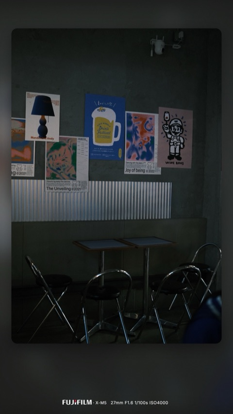
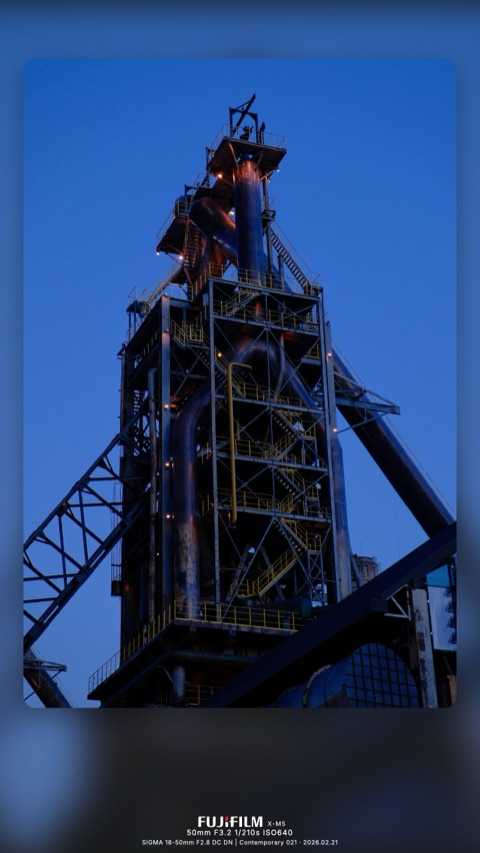

<div align="center">


# photo-tools

**给照片套上磨砂玻璃相框 — 浏览器内渲染，无需服务器。**

[](https://anois.github.io/photo-tools/)
[](https://photo-tools.oss-cn-hangzhou.aliyuncs.com/)
[](#技术栈)
[](#快速开始)
[](https://github.com/anois/photo-tools)

中文 · [English](README.md)

</div>

一个纯前端单页应用，把照片包进"磨砂玻璃"相框 —— 自己模糊后的背景 + 圆角前景 + 带品牌 logo 的 EXIF 字幕。拖入照片、选风格、导出。全程在浏览器里跑，不上传、无后端。

```
   ┌─────────────────────┐
   │ ░░░░░░░░░░░░░░░░░░ │
   │ ░ ┌──────────────┐ ░ │       自己当背景模糊
   │ ░ │              │ ░ │       + 圆角前景
   │ ░ │    photo     │ ░ │       + EXIF 字幕
   │ ░ │              │ ░ │
   │ ░ └──────────────┘ ░ │
   │   FUJIFILM  X-T5    │
   │   46mm  F4.5  1/210s │
   └─────────────────────┘
```

## 特性

- **5 种相框风格** — frosted、frosted-dark、white、black、polaroid
- **5 种字幕模板** — minimal-text、brand-logo、brand-right、tech-stack、date-lens
- **真实品牌 logo 内嵌** — Fujifilm、Sony、Leica、Nikon、Canon、Apple、Xiaomi、OPPO、Vivo、DJI…（来自 Wikimedia Commons + simple-icons）
- **EXIF 自动解析**，每张照片可独立手动覆盖；当 `LensModel` 缺失时用 `LensInfo` 数组反推镜头型号
- **实时预览** 走 Canvas2D + GPU 的 `ctx.filter` blur，不走服务端往返
- **单张 + 批量导出** 都保留源图 EXIF（Make / Model / 焦距 / 光圈 / 快门 / ISO / 镜头 / 日期 / GPS）
- **Web Worker 池** 把批量渲染挪出主线程
- **移动端适配** — 用 sticky preview + 垂直堆叠布局，调参时预览始终可见

## 效果预览

来自实际渲染管线的两张样张：

<table>
  <tr>
    <td width="50%"></td>
    <td width="50%"></td>
  </tr>
  <tr>
    <td align="center"><sub><b>frosted-dark</b> · <b>minimal-text</b><br/>FUJIFILM X-M5 · 27mm F1.6 1/100s ISO4000</sub></td>
    <td align="center"><sub><b>frosted</b> · <b>tech-stack</b><br/>FUJIFILM X-M5 · SIGMA 18-50mm F2.8 · 2026.02.21</sub></td>
  </tr>
</table>

<sub>上面是 480px 预览，全分辨率成品（`data/*_framed.jpg`）和原图都放在 [`data/`](data/) 目录下，方便对照。</sub>

## 快速开始

```bash
git clone https://github.com/anois/photo-tools.git
cd photo-tools
npm install
npm run build       # 生成 logos.json + fonts.css
npm run dev         # → http://localhost:3000
```

打开浏览器、拖入照片、调参、导出。就这样。

## 工作原理

```
┌──────────────────────────── 浏览器标签页 ────────────────────────────┐
│                                                                      │
│  index.html → <script> 第三方库 (exifr, piexif, jszip)              │
│             → <script> shared/render.js   (布局 + 相框 + 字幕 SVG)   │
│             → <script> exifio.js          (解析 + 写回 JPEG EXIF)    │
│             → <script> clientRender.js    (Canvas 合成管线)          │
│             → <script> exporter.js        (单张 + 批量 + ZIP)        │
│             → <script> app.js             (UI + 每张照片的 cfg)      │
│                                                                      │
│  启动时 fetch: logos.json (~60KB)  +  fonts.css (~870KB Inter base64)│
└──────────────────────────────────────────────────────────────────────┘
```

单一共享模块 [`public/shared/render.js`](public/shared/render.js) 持有所有的布局数学、相框定义、字幕 SVG 构造、模板渲染逻辑。屏幕预览和高分辨率导出走同一份代码路径，区别只在 canvas 尺寸。

更详细的架构文档见 [CLAUDE.md](CLAUDE.md)。

## 项目结构

```
photo-tools/
├── public/                 ← 部署产物（无构建步骤）
│   ├── index.html
│   ├── app.js              ← UI 接线 + 每张照片的 cfg 状态
│   ├── shared/render.js    ← 布局 + 相框 + 字幕 SVG（唯一源）
│   ├── clientRender.js     ← Canvas2D 合成管线（预览 + 导出）
│   ├── exifio.js           ← EXIF 解析 (exifr) + JPEG 重新写回 (piexifjs)
│   ├── exporter.js         ← 单张 + 批量导出 + ZIP 打包
│   ├── worker.js           ← 批量渲染的 worker 实现
│   ├── progressModal.js    ← <dialog> 进度框控制
│   ├── styles.css
│   ├── logo.svg            ← 项目 logo（favicon + README 头图）
│   ├── vendor/             ← exifr、piexif、jszip（vendored，不走 CDN）
│   ├── logos/*.svg         ← 品牌 logo 源 SVG（Wikimedia + simple-icons）
│   ├── fonts/*.ttf         ← Inter Regular + SemiBold
│   ├── logos.json          ← 由 logos/*.svg 构建生成
│   └── fonts.css           ← 由 fonts/*.ttf 构建生成
├── scripts/
│   ├── build-logos.js      ← logos/*.svg  → logos.json
│   ├── build-fonts.js      ← fonts/*.ttf  → fonts.css
│   └── fetch-logos.sh      ← 从 Wikimedia Commons / simple-icons 抓取
└── data/                   ← 参考图（输入 + 成品）
```

## 部署

`public/` 目录就是完整的部署产物 —— 不转译、不打包。任何静态托管都能用。

**GitHub Pages**（线上：[anois.github.io/photo-tools](https://anois.github.io/photo-tools/)，免费）：

工作流文件在 [.github/workflows/deploy.yml](.github/workflows/deploy.yml)。每次 push 到 `main` 自动触发：装依赖 → `npm run build` → 上传 `./public/` → 发布。也可以在 **Actions** 页面手动重跑。

**一次性配置**：仓库 Settings → Pages，把 **Source** 设成 `GitHub Actions`。

**其它平台**（S3 + CloudFront、Cloudflare Pages、Netlify、Vercel…）：思路一样，跑 `npm run build` 后把 `public/` 指给它们。

### 国内访问镜像（阿里云 OSS）

GitHub Pages 在大陆访问偶尔慢、偶尔不通。同一份 `public/` 产物会同步到阿里云 OSS（华东1 杭州，未备案）作国内访问入口：

```
https://photo-tools.oss-cn-hangzhou.aliyuncs.com/
```

部署 job（[deploy.yml](.github/workflows/deploy.yml) 里的 `deploy-oss`）跟 GitHub Pages job **并行**跑 —— 一边挂了不影响另一边。

**首次配置**（OSS 首次部署前需要做）：

1. **创建 Bucket**：OSS 控制台 → 创建 Bucket
   - 区域：`oss-cn-hangzhou`（也可以选其它大陆区）
   - 读写权限：**公共读**（`public-read`）
   - 进入 Bucket → 静态网站设置，默认首页填 `index.html`
2. **创建 RAM 子用户**：RAM 控制台 → 用户 → 创建用户 `photo-tools-deploy`
   - 访问方式：**OpenAPI 调用访问**
   - 单独创建一个仅作用于该 bucket 的最小权限策略：
     ```json
     {
       "Version": "1",
       "Statement": [{
         "Effect": "Allow",
         "Action": ["oss:PutObject", "oss:DeleteObject", "oss:GetObject", "oss:ListObjects"],
         "Resource": ["acs:oss:*:*:photo-tools", "acs:oss:*:*:photo-tools/*"]
       }]
     }
     ```
   - 保存好 AccessKey ID 和 Secret（**只显示一次**）
3. **添加 GitHub Secrets**（Settings → Secrets and variables → Actions → New secret）：
   - `ALIYUN_ACCESS_KEY_ID`
   - `ALIYUN_ACCESS_KEY_SECRET`
   - `ALIYUN_OSS_BUCKET` = `photo-tools`
   - `ALIYUN_OSS_ENDPOINT` = `oss-cn-hangzhou.aliyuncs.com`
4. **添加一个 repo variable** 来开启 OSS 部署：
   - Settings → Secrets and variables → Actions → **Variables** → `ENABLE_OSS_DEPLOY` = `true`

**注意**：阿里云大陆区直连 OSS 域名（`*.oss-cn-<region>.aliyuncs.com`）作为面向终端用户的站点访问时，由于域名未 ICP 备案，偶尔会被插入安全提示页或限流。个人小流量使用一般没问题。如果触发，可降级到：

- **香港区**（`oss-cn-hongkong.aliyuncs.com`）—— 不需备案、无安全检查页，但延迟略高（大陆 ping 50–100ms）
- **自定义域名 + 阿里云 CDN**（需 ICP 备案，7–20 工作日）—— 长期最佳的国内访问体验

## 技术栈

- **原生 HTML/JS** —— 无框架、无转译、运行时无构建管线
- **CommonJS** —— [`public/shared/render.js`](public/shared/render.js) 是 UMD 模块，同一份源文件既能在浏览器跑，也能在 Node 端通过 `require()` 做即兴渲染冒烟检查
- **Canvas2D + WebWorker** —— `createImageBitmap` 解码、`ctx.filter='blur()'` 做磨砂背景、`ctx.drawImage` 合成、`OffscreenCanvas.convertToBlob` 编码
- **Vendored 依赖** —— [exifr](https://github.com/MikeKovarik/exifr)、[piexifjs](https://github.com/hMatoba/piexifjs)、[JSZip](https://stuk.github.io/jszip/) —— 不依赖 CDN

## 添加品牌 logo

1. 把 `public/logos/<品牌-slug>.svg` 放进去（推荐 Wikimedia 多色版；simple-icons 单色版也支持）
2. `npm run build-logos`
3. 刷新浏览器即可。如果 EXIF 的 `Make` 字段跟 slug 不直接匹配，去 [`public/shared/render.js`](public/shared/render.js) 的 `ALIASES` 里加一条映射

## 添加相框 / 模板 / 长宽比

参考 [CLAUDE.md](CLAUDE.md#extending) 的 **Extending** 节 —— 各自有简短的 step-by-step 说明。

## 个人使用声明

这是一个个人照片工具。打包的第三方资产（品牌 logo、Inter 字体）用于个人照片合成；不分发、不商用。Bug 报告和渲染质量优先于法律层面的过度顾虑。

---

<div align="center">
<sub><a href="https://github.com/anois/photo-tools">github.com/anois/photo-tools</a></sub>
</div>
