<div align="center">


# photo-tools

**给照片套上像真胶片相纸一样的成片美学。**

挑一颗种子 · 在工作台 fork · 一条 URL 发出去。100% 在浏览器里跑。

<p>
<a href="https://anois.github.io/photo-tools/"></a>
</p>

<sub>
<a href="https://photo-tools.oss-cn-hangzhou.aliyuncs.com/">国内镜像</a> ·
<a href="public/CHANGELOG.md">v1.0.0</a> ·
<a href="LICENSE">MIT</a> ·
<a href="README.md">English</a>
</sub>

</div>

---

photo-tools 是一台完全跑在浏览器里的照片成片引擎。拖入一张照片（JPEG / PNG / HEIC），从 7 套成片美学里挑一套 —— 银盐暗房印品、装裱柯达彩色幻灯片、带齿孔的 35mm 负片、撕纸边、毛玻璃卡纸、画廊衬纸、即拍即得 —— 然后要么直接出片，要么打开工作台把每一个渲染参数都重新写一遍。一个 LOOK 就是一份 JSON 快照，你可以把自己调出来的 look 存下来、用 `#p=...` URL 发出去，或者从自己的 S3 / R2 / OSS bucket 反向回传到别人的胶卷。除非你主动选择上云，照片不会离开你的设备。

## 7 种成片美学 · 同一台引擎

下面 5 张不是"皮肤"。每一张都是调到位的起点 —— 引擎层面每一个渲染参数（相框 · 字幕模板 · 边距 · 圆角 · 字幕位置 · 顶部标记 · 颗粒 · 阴影 …）都从工作台可达、能编进你自己的 LOOK。

<table>
  <tr>
    <td width="20%" align="center">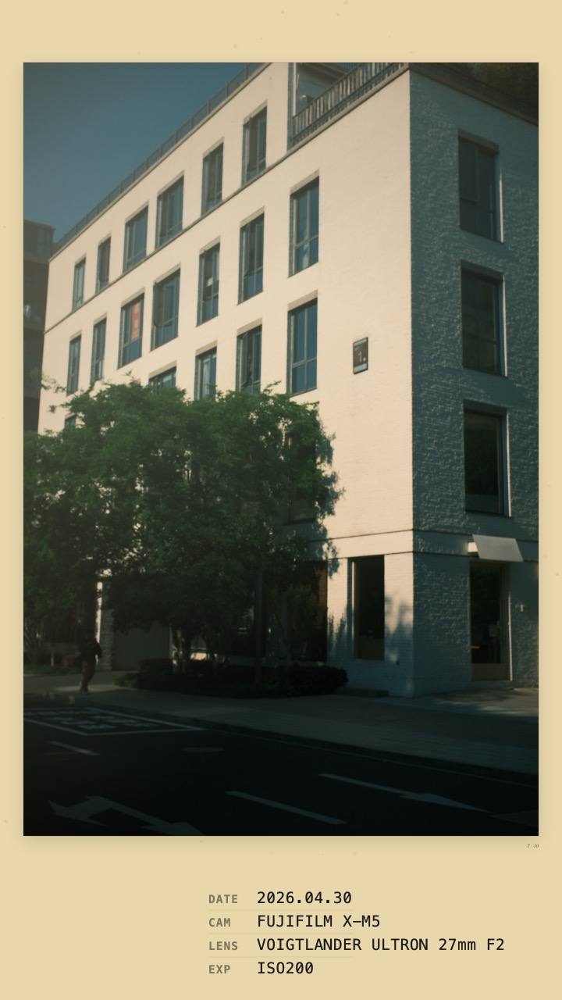</td>
    <td width="20%" align="center">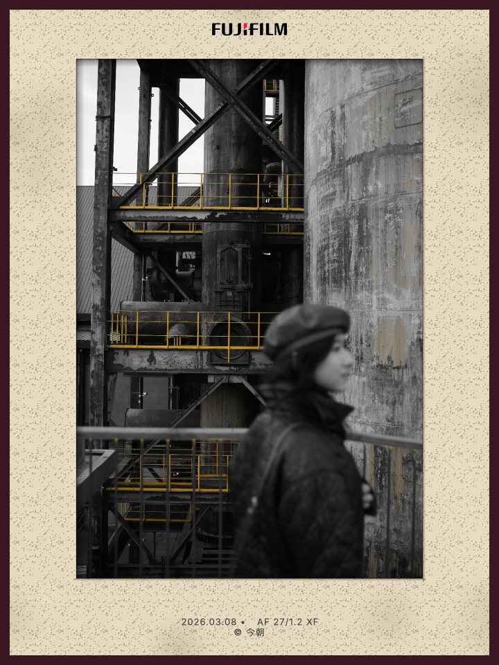</td>
    <td width="20%" align="center">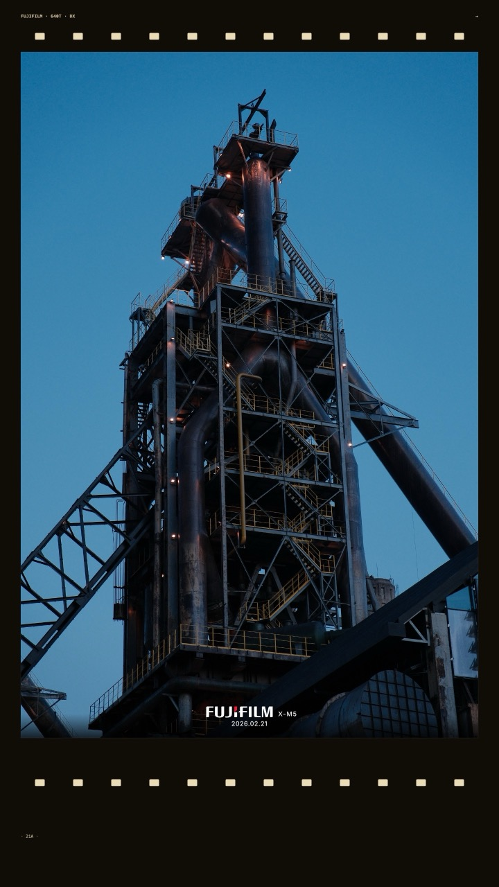</td>
    <td width="20%" align="center">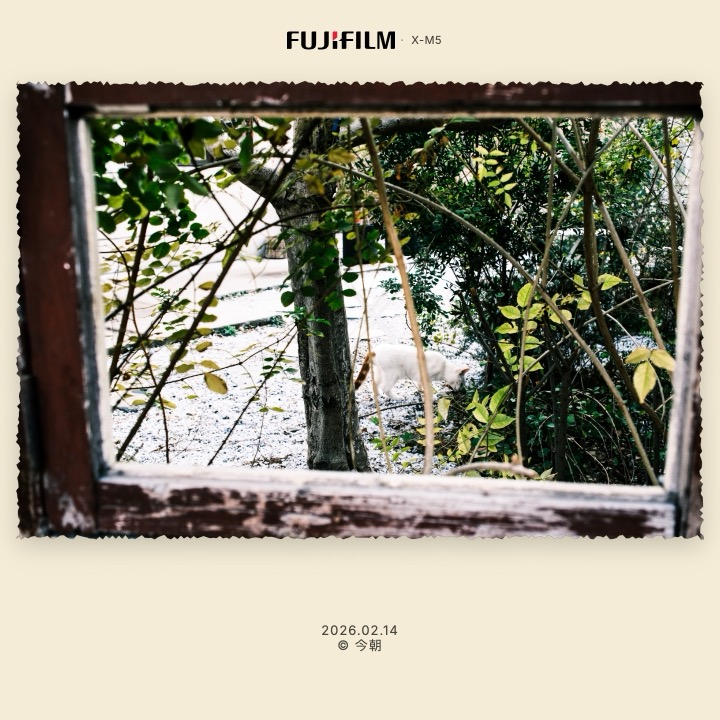</td>
    <td width="20%" align="center"></td>
  </tr>
  <tr>
    <td align="center"><sub><b>📽 银盐印品</b><br/><code>film-mf</code> · slate</sub></td>
    <td align="center"><sub><b>🎞 幻灯片</b><br/><code>slide-mount</code> · date-lens</sub></td>
    <td align="center"><sub><b>🎞 35mm 胶卷</b><br/><code>film-35</code> · wordmark</sub></td>
    <td align="center"><sub><b>📜 撕纸</b><br/><code>torn</code> · brand-model</sub></td>
    <td align="center"><sub><b>✨ 夜色毛玻璃</b><br/><code>frosted-noir</code> · brand-logo</sub></td>
  </tr>
</table>

<sub>上面是 720px 缩略图，全分辨率成品放在 <a href="data/samples/"><code>data/samples/</code></a>。</sub>

## 30 秒一张片

1. **把照片拖到画布上。** EXIF 自动解析；HEIC 通过懒加载的 libheif wasm 在浏览器内转码，iPhone 照片不用先转格式
2. **挑一个 LOOK**（或从剪贴板粘贴别人发过来的 `#p=` 分享码）。开盒就有 5 个调到位的种子；你自己存的预设排在下面
3. **导出。** 单张 → JPEG / PNG；批量 → ZIP，走 Web Worker 池。EXIF 完整保留（Make / Model / 焦距 / 光圈 / 快门 / ISO / 镜头 / 日期 / GPS）

<table>
  <tr>
    <td width="50%">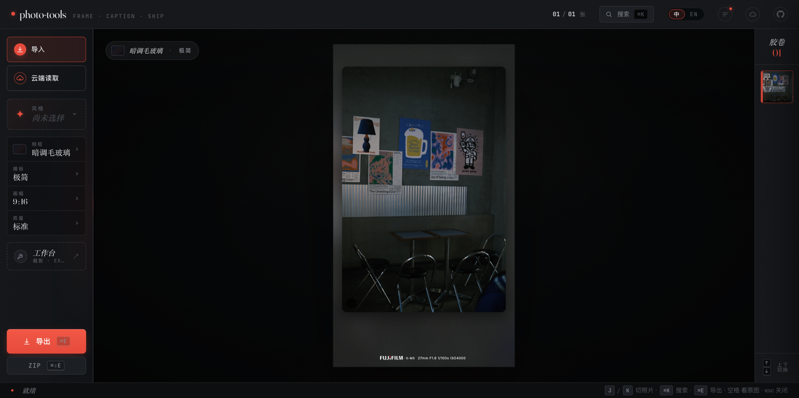</td>
    <td width="50%">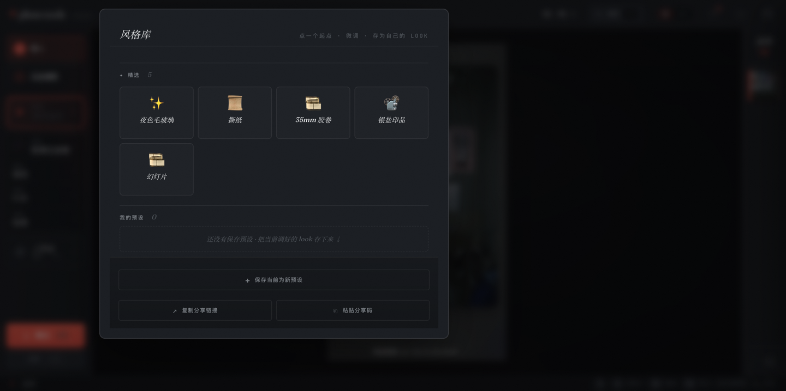</td>
  </tr>
  <tr>
    <td align="center"><sub>主界面 — sidebar / canvas / 胶卷</sub></td>
    <td align="center"><sub>LOOK picker — 精选 + 我的预设 + 分享 / 粘贴</sub></td>
  </tr>
</table>

## 工作台 · LOOK 是种子，不是皮肤

产品模型是**引擎 + 社区风格库**，不是"固定相框 + 几个滑块"。当种子不太对你这张照片的味，工作台展开就是引擎所有暴露出来的旋钮：圆角、水印嵌入图片 + 离底高度、撕纸抖动 / 密度 / 暗边、复古印品老化程度、顶部标记 picker、自定义背景图、阴影三连、可在画面任意位置自由拖拽放置的印记 / 签名水印（落到照片上或相框留白都行，带旋转 / 水平翻转 / 混合模式）。每一个改动都可以存成新 LOOK，可以分享，也可以一键应用到整条胶卷。

调参本身就是暗房里的看样：握住任何旋钮，工作台自己退后让灯光落在照片上 —— 数值浮在画布上方，一圈琥珀虚线圈出你正在改的区域，拖动全程 60fps 跟手。按住 ◐ 回看进工作台那一刻的样子；按 ◫ 把最近的旋钮扫成一张四档试印条，点中意的那条直接采用。

<table>
  <tr>
    <td width="50%">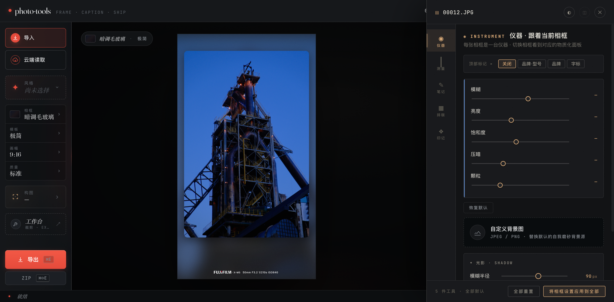</td>
    <td width="50%">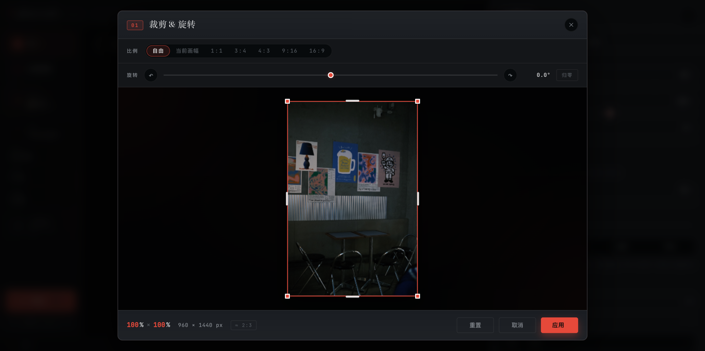</td>
  </tr>
  <tr>
    <td align="center"><sub>工作台 — 引擎每一个旋钮都在</sub></td>
    <td align="center"><sub>裁剪 & 旋转 — 渲染时应用，源图不动</sub></td>
  </tr>
</table>

## 构图模式 · 一台暗房工作台

裁剪、旋转、四边距合并进一台暖深棕底 + 单一琥珀 safelight 的全屏直接拖拽工作台 —— 三种工具严格互斥，点击底部对应模块激活后才能在照片上操作，避免"全部同时可点"的视觉干扰。裁剪给你 7 个预设比例 + 自定义 W:H 一键锁定；旋转是一条 360° 拖拽条支持任意角度，被切掉的部分以 30% 透明度作为"幽灵层"留在画面外让你随时看到牺牲了什么；四边距各自独立，相框还会贴心地告诉你"film-35 顶部最好留 70px 给齿孔"这种推荐下限 —— 拉低了警告但不阻止，最终听你的。

<table>
  <tr>
    <td width="50%">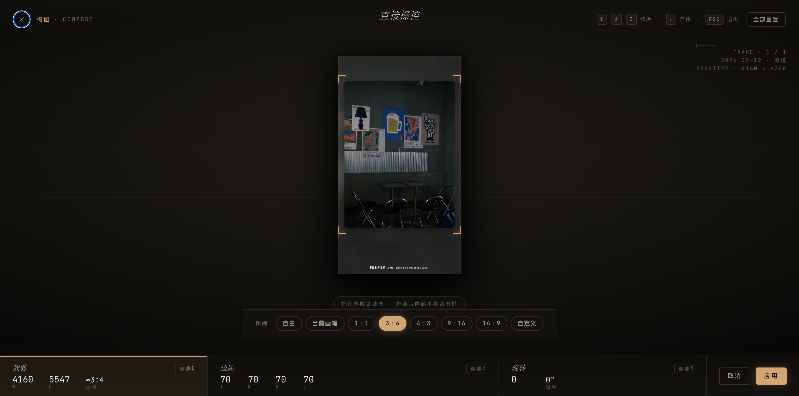</td>
    <td width="50%">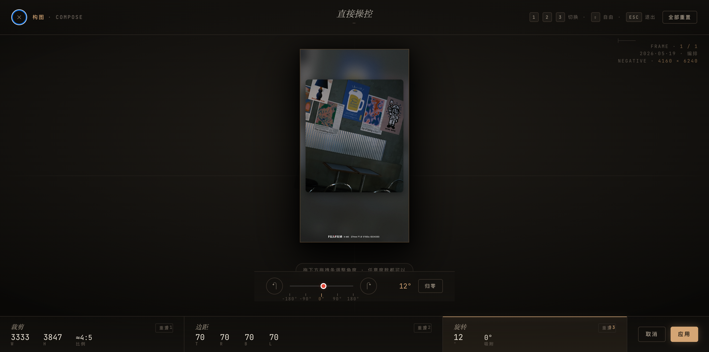</td>
  </tr>
  <tr>
    <td align="center"><sub>裁剪 — 8 个预设比例 chip + 拖角括号</sub></td>
    <td align="center"><sub>旋转 — 360° 拖拽条 + 幽灵层告诉你什么被切掉</sub></td>
  </tr>
</table>

## 分享是一条 URL，不是一份文件

一个 LOOK = base64url 编码的 JSON 快照。复制 `#p=<code>` 当聊天消息发出去，对方应用 boot 时自动套上。要分享**照片**（不只是 look），云相册模块直接在浏览器里走 SigV4 签 你自己的 bucket：上传胶卷、复制 `#s3=<code>` URL，对方打开看到你的画廊 —— 缩略图网格 + lightbox 大图预览 + 单张下载 + 多选打包 ZIP。纯前端签名（vendored aws4fetch，~12 KB，首次打开云面板才懒加载），三家 provider（AWS S3 / Cloudflare R2 / 阿里云 OSS）一站搞定。

<table>
  <tr>
    <td width="50%" align="center">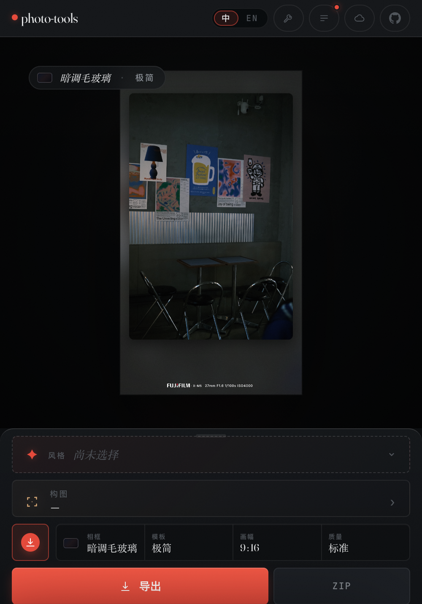</td>
    <td width="50%" align="center">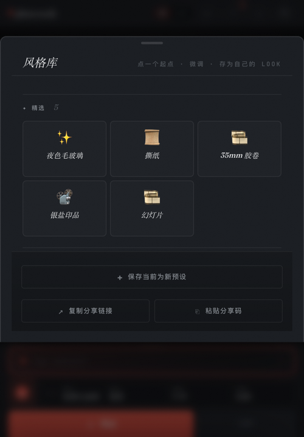</td>
  </tr>
  <tr>
    <td align="center"><sub>移动端主界面 — lookbar 在拇指区</sub></td>
    <td align="center"><sub>移动端 LOOK picker — bottom sheet 原生交互</sub></td>
  </tr>
</table>

## 工具箱里都有什么

| 维度 | 内容 |
|---|---|
| **相框** | 5 个家族 · 8 个手调风格 —— 编辑（`frosted-noir`）/ 画廊（`gallery-white`）/ 即影（`instax` · `torn`）/ 胶片（`film-35` · `film-mf` · `slide-mount`）/ 印刷（`halftone` —— 双色理索网屏，油墨 / 纸色 / 网点密度 / 颗粒 / 角度 / 形状 / 明暗七旋钮） |
| **字幕** | 4 个语法 · 11 个模板 —— Spec（`minimal-text` · `tech-stack` · `spec-grid` · `spec-rail`）/ Brand（`brand-logo` · `brand-right`）/ Editorial（`wordmark` · `headline`）/ Stamp（`date-lens` · `slate` · `passport`） |
| **引擎** | 每个渲染参数 UI 可达 + preset 可捕获 · LOOK 种子作为一级入口 · `#p=<code>` 分享链接完整 round-trip |
| **输入** | JPEG / PNG / HEIC（libheif 懒加载）· 自动 EXIF · `LensInfo` → 镜头型号反推 · 每张照片可独立手动覆盖 |
| **输出** | 单张 + 批量（Web Worker 池）· JPEG / PNG · EXIF 完整 round-trip · 云相册 RAW 原图直通 |
| **构图** | 拼贴 2 / 3 / 4 格 · **构图模式** 裁剪 + 任意角度旋转 + 四边距独立调整 · **无相框模式**（只导出风格化后的照片本体 —— 无边距 / 字幕 / 装饰）· 裁剪预设比例（自由 / 当前画幅 / 1:1 / 3:4 / 4:3 / 9:16 / 16:9 / 自定义 W:H）· 渲染时应用，源图不动 · GPS 自动解析 + 手填 + 地图选点（Leaflet + 高德地图，GCJ-02 ↔ WGS-84 校正） |
| **云端** | 浏览器直签 SigV4 到你自己的 bucket（AWS S3 / Cloudflare R2 / 阿里云 OSS）· `#s3=<code>` 分享链接 · 上传 / 画廊 / 灯箱 / 多选打包下载 |
| **平台** | 可安装 PWA · 离线壳 · 中英文 UI · 内置 Fujifilm · Sony · Leica · Nikon · Canon · Apple · Xiaomi · OPPO · Vivo · DJI · … 品牌 logo |
| **形态** | 桌面与移动各自说自己的手势语言 —— 桌面 sidebar + 键盘快捷键，移动 bottom sheet + 拇指区 CTA + 横滑切片 |

## 自己跑起来

```bash
git clone https://github.com/anois/photo-tools.git
cd photo-tools
npm install
npm run build       # 生成 logos.json + fonts.css
npm run dev         # → http://localhost:3000
```

不转译、不打包、无后台进程 —— `serve` 只是托管静态文件。

- **深入架构**（渲染管线、cfg / LOOK / 分享链接数据模型、frame & template 体系、PWA 缓存层、云端模块，加上"fork 改一改"时怎么加新相框 / 模板 / 画幅 / 品牌 logo / 翻译字符串的步骤）→ [`docs/architecture.md`](docs/architecture.md)
- **部署**（GitHub Pages 工作流、其他静态托管、阿里云 OSS 国内镜像完整配置、自定义域名）→ [`docs/deploy.md`](docs/deploy.md)

## 🤖 由 Claude Code 维护

**本仓库的每一条 commit 都由 [Claude Code](https://claude.com/claude-code) session 产出。** 代码、相框定义、渲染数学、UI 接线、CSS、i18n 文案、这份 README、CHANGELOG、deploy workflow —— 可见历史里没有一行人类写下的代码，也不打算有。这是项目实际的运作模式，不是 marketing 语。

- **理论上不接受人类发起的 PR。** 请不要开 —— 它不会被合并。本仓库唯一的提交者身份就是 Claude Code 维护流水线
- **输入通道 = [GitHub Issue](https://github.com/anois/photo-tools/issues/new)。** 中文也行，几句话描述你想要什么。合理的 Issue 会被定时捞起来，交给一次 Claude Code session 实现 + 自测 + 写 CHANGELOG + 开 PR + （维护者本地验收之后）合并 + 自动部署
- **可审计**：每一条上线的改动都记到 [`public/CHANGELOG.md`](public/CHANGELOG.md)，应用顶栏 ✦ pill 在 app 内呈现；commit 历史是审计追溯线，PR 描述是 why-it-shipped 的记录

## License

代码部分采用 [MIT](LICENSE)。

仓库内同时打包了第三方资产，各自的 license 见原始声明：

- **Inter** 字体子集采用 [SIL Open Font License 1.1](https://fonts.google.com/specimen/Inter)
- **品牌 logo SVG**（`public/logos/*.svg`）来自 Wikimedia Commons 和 [simple-icons](https://simpleicons.org/)（CC0）。logo 本身归各自品牌商标持有人所有，这里仅用于个人照片元信息合成
- **Vendored 库** 各自的 upstream license：exifr (MIT) / piexifjs (MIT) / JSZip (MIT/GPL) / libheif-js (LGPL) / Leaflet (BSD-2-Clause) / aws4fetch (MIT)

本项目是个人照片工具。bundled 第三方资产仅用于个人照片合成，不做再分发、不构成商业产品。bug 修复和出片质量优先于理论上的法律 hedging。

---

<div align="center">
<sub><a href="https://github.com/anois/photo-tools">github.com/anois/photo-tools</a> · 每一行都由 <a href="https://claude.com/claude-code">Claude Code</a> 产出</sub>
</div>
